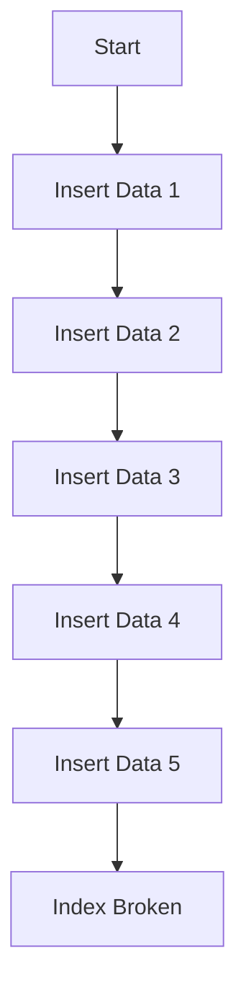
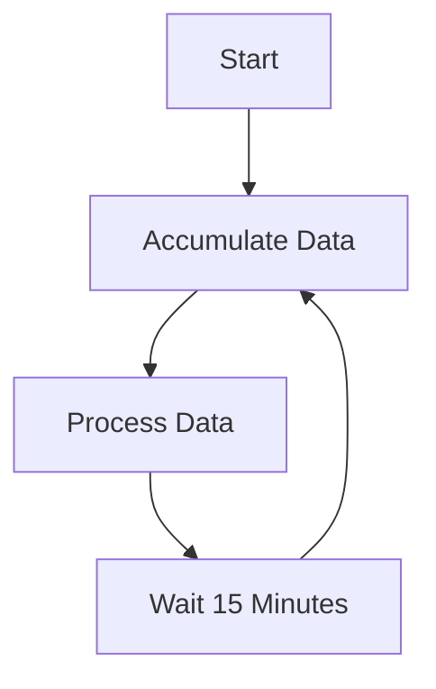

# Accumulator: A Go-based Data Accumulation Mechanism

## Overview

Accumulator is a lightweight Go library designed to aggregate, manage, and process data items. Whether you're accumulating data from various sources, processing them at specific intervals, or simply managing a stream of data, this library provides the tools you need.

## Features

- **Flexible Storage**: Choose from built-in storage options like in-memory storage or integrate with your custom storage mechanism.
- **Customizable Processing**: Define how data items are processed using your custom function.
- **Configurable Interval**: Set the interval at which accumulated data is processed.
- **Scheduled Processing**: Optionally start processing data at a specific time.

## Installation

To install the package, simply run:

```bash
go get github.com/9ssi7/acc
```

## Documentation

[](https://pkg.go.dev/github.com/9ssi7/acc)

## Flow Diagrams

### Continuous Insert with DB Index Issues



### Using Accumulator for Batch Processing




## Usage

### Basic Setup

Here's a basic example demonstrating how to set up an accumulator:

```go
package main

import (
	"fmt"
	"time"

	"github.com/9ssi7/acc"
)

func main() {
	accumulator := acc.New(acc.Config[int]{
		Processor: processFunction,
		// ... other configurations
	})
	// Start using the accumulator
}

func processFunction(ctx context.Context, data []int) {
	// Your logic to process data
	fmt.Println("Processing data:", data)
}
```

### Advanced Configurations

#### Using StartTime Configuration

To start the accumulator processing at a specific time, you can use the `StartTime` configuration. Below is an example demonstrating how to set a start time:

```go
func main() {
	accumulator := acc.New(acc.Config[int]{
		Processor: processFunction,
		StartTime: time.Date(2024, time.December, 31, 23, 59, 0, 0, time.UTC), // Processing will start on New Year's Eve at 23:59
		// ... other configurations
	})
	// Start using the accumulator
}
```

#### Using Interval Configuration

To configure the interval at which accumulated data is processed, you can set the `Interval` configuration. Below is an example demonstrating how to set an interval:

```go
func main() {
	accumulator := acc.New(acc.Config[int]{
		Processor: processFunction,
		Interval:  30 * time.Second, // Data will be processed every 30 seconds
		// ... other configurations
	})
	// Start using the accumulator
}
```

### Starting the Accumulator Asynchronously

To start the accumulator asynchronously using a goroutine, you can use the following approach:

```go
func main() {
    accumulator := acc.New(acc.Config[int]{
        Processor: processFunction,
        Interval:  30 * time.Second, // Data will be processed every 30 seconds
        // ... other configurations
    })

    // Start the accumulator in a goroutine
    go func() {
        if err := accumulator.Start(context.Background()); err != nil {
            fmt.Println("Error starting accumulator:", err)
        }
    }()

    // You can continue with other operations or wait for user input to exit
    // For example:
    // fmt.Println("Press Ctrl+C to exit...")
    // select {}
}
```

By starting the accumulator in a goroutine, it will run in the background, allowing the main program flow to continue without interruption.

## Contributing

We welcome contributions! Please see our [Contribution Guidelines](CONTRIBUTING.md) for details.

## License

This project is licensed under the Apache License. See [LICENSE](LICENSE) for more details.